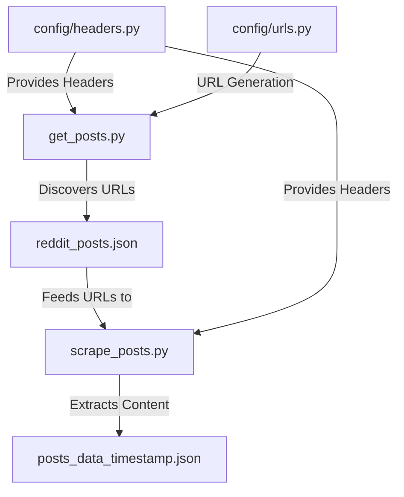
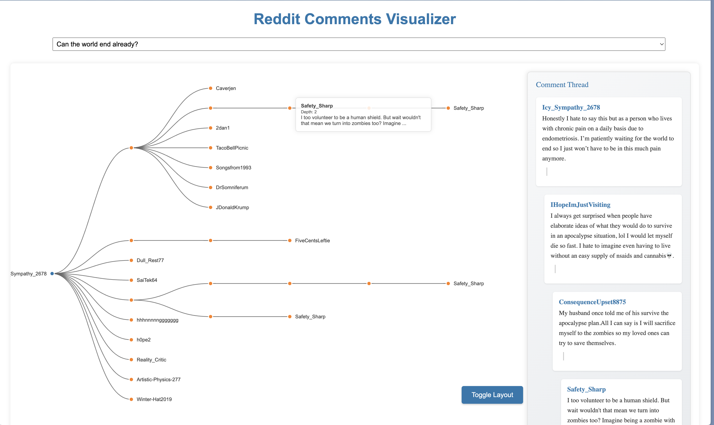

# Reddit Data Scraper for r/ChronicPain (with Optional Visualization)

This project focuses on scraping and collecting data from Reddit, specifically targeting the r/ChronicPain community. It provides a robust system for extracting posts and their associated comment threads, storing the data in a structured JSON format. As a secondary feature, it includes a basic web-based visualization tool to explore the collected comment data, but the primary purpose is data acquisition.

## Project Focus: Data Collection

The core of this project is a powerful Reddit scraping system designed for efficient and responsible data collection. It's built to:

-   Discover relevant posts from r/ChronicPain
-   Extract complete post details, including title, author, content, score, and more
-   Recursively scrape entire comment threads, capturing nested replies and "load more comments" sections
-   Handle Reddit's pagination and rate limiting
-   Output structured JSON data ready for analysis or other applications

## Scraping Architecture

The scraping process is divided into two main components:

1. **Post Discovery (`get_posts.py`)**: Identifies and collects post URLs from r/ChronicPain.
2. **Content Extraction (`scrape_posts.py`)**: Retrieves detailed content from the collected post URLs, including comments and their nested structure.



### Key Scraping Features

#### Post Discovery (`get_posts.py`)

-   **Pagination Handling:** Seamlessly navigates through multiple pages of Reddit feeds.
-   **Duplicate Detection:** Avoids scraping the same post multiple times.
-   **Configurable Limits:** Allows setting the number of posts to scrape.
-   **Session Management:** Maintains cookies and session state for consistent scraping.
-   **Rate Limiting:** Implements configurable delays to respect Reddit's API usage guidelines.
-   **JSON Output:** Stores discovered post URLs in a `reddit_posts.json` file.

#### Content Extraction (`scrape_posts.py`)

-   **Full Post Extraction:** Retrieves comprehensive post details.
-   **Recursive Comment Scraping:** Traverses the entire comment tree, including nested replies.
-   **"Load More Comments" Handling:** Automatically expands and scrapes hidden comments.
-   **Structured JSON Output:** Stores scraped data in `posts_data_{timestamp}.json` files with a well-defined format (see "Data Structure" below).
-   **Error Handling:** Includes retry logic with exponential backoff for robustness.
-   **Progress Tracking:** Provides detailed console output during the scraping process.

### Configuration

The `config` package provides centralized management for:

-   **HTTP Headers (`headers.py`):** Set your `User-Agent` and any other necessary headers.
-   **URL Generation (`urls.py`):** Helper functions to construct Reddit URLs.
-   **Rate Limiting:** Configure delays between requests.

### Data Structure

The scraper outputs data in the following JSON format:

```json
{
  "title": "Post Title",
  "author": "Username",
  "created_timestamp": "1234567890",
  "score": 42,
  "upvote_ratio": 0.95,
  "content": "Post content text",
  "post_id": "t3_abc123",
  "comments": [
    {
      "thing_id": "t1_def456",
      "depth": 0,
      "parent_id": "t3_abc123",
      "author": "Commenter",
      "text": "Comment text",
      "action_id": "comment_action_id",
      "more_replies": null,
      "replies": []
    }
  ]
}
```

### Ethical Considerations and Rate Limiting

This scraper is designed with ethical data collection in mind:

-   **Configurable Delays:** You can adjust the time between requests to avoid overloading Reddit's servers.
-   **User-Agent:** Set a custom User-Agent to identify your scraper.
-   **Respect for `robots.txt`:** The scraper adheres to Reddit's guidelines for automated access.
-   **Error Handling with Exponential Backoff:**  If errors occur, the scraper waits for an increasing amount of time before retrying, reducing the load on Reddit.

## Installation

1. Clone the repository:

    ```bash
    git clone https://github.com/yourusername/reddit-comment-tree-visualizer.git
    cd reddit-comment-tree-visualizer
    ```

2. Install Python dependencies:

    ```bash
    pip install -r requirements.txt
    ```

3. Set up your Reddit headers in `config/headers.py`:

    ```python
    REDDIT_HEADERS = {
        'User-Agent': 'your-user-agent',  # IMPORTANT: Replace with your own User-Agent
        # Add other necessary headers if needed
    }
    ```

## Usage

1. **Discover Posts:**

    ```bash
    python get_posts.py
    ```

    This will generate a `reddit_posts.json` file containing URLs of posts from r/ChronicPain.

2. **Scrape Content:**

    ```bash
    python scrape_posts.py
    ```

    This will read the URLs from `reddit_posts.json`, scrape the content, and save it to `posts_data_YYYYMMDD_HHMMSS.json` files.

## Optional Visualization

The project includes a simple web-based visualization tool that you can use to explore the scraped comment data. It's built with HTML, CSS, and D3.js.

[](https://julienh.github.io/reddit-comment-tree-visualizer/)

**To use the visualization:**

1. Make sure you have scraped some data using the steps above.
2. Open `public/index.html` in a web browser.

**Visualization Features:**

-   Interactive tree diagram of comment threads
-   Basic zoom and pan
-   Comment preview on hover
-   Option to switch between horizontal and vertical layouts

**Note:** The visualization is a basic tool for exploring the data. It is not the primary focus of this project.

## Technology Stack

-   **Python 3.x:**
    -   `BeautifulSoup4`: For parsing HTML content.
    -   `Requests`: For making HTTP requests.
-   **(Optional) Frontend (Visualization):**
    -   `HTML5/CSS3`
    -   `D3.js v7`
    -   `Vanilla JavaScript`

## Contributing

Contributions are welcome! If you want to improve the scraper, add features, or enhance the visualization, feel free to submit a Pull Request.

## License

This project is licensed under the MIT License - see the LICENSE file for details.

## Acknowledgments

-   Reddit API
-   BeautifulSoup4 Documentation
-   (Optional) D3.js Community